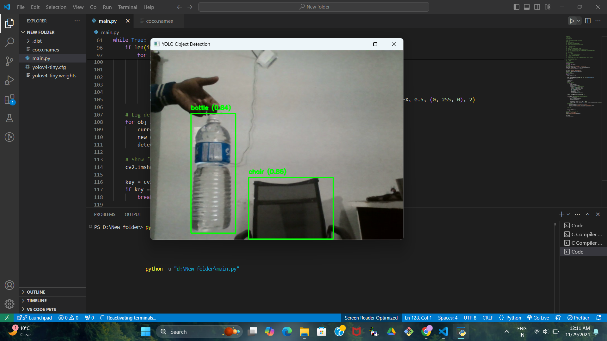
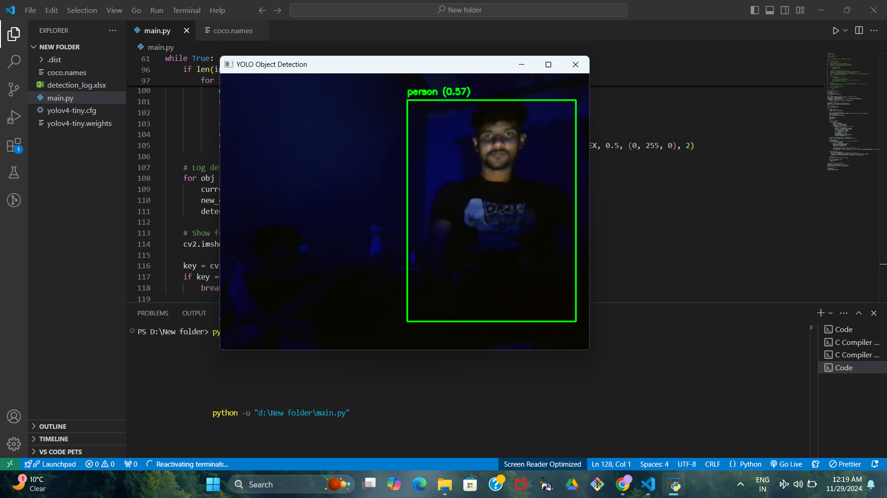

# Object-Detection-and-Tracking
## Using Webcam Feed 🎥

This project implements real-time object detection using a webcam feed. It leverages the YOLO (You Only Look Once) algorithm to detect objects in the video feed and label them with confidence scores.

## Features 🌟
- Real-time object detection using YOLO.
- Webcam-based object detection.
- Detects 80+ objects from the COCO dataset.
- Easy-to-use and customizable.

---

## Installation ⚙️

1. Clone the repository:
   ```bash
   git clone https://github.com/rishav0821/Object-Detection-and-Tracking
   cd Object-Detection-Webcam

2. Install the dependencies:

```bash
pip install -r requirements.txt
```
3. Download the YOLO model files:

- Download the YOLO configuration and weights files from:
  - YOLOv4.cfg
  - YOLOv4.weights
- Place them in the data/ folder.

4. Add the COCO names file:

- Download it from here.
- Place it in the data/ folder.

## Requirements 🛠️
- Python 3.7+
- OpenCV
- Numpy
- imutils

Install all required Python packages using:

```bash
pip install -r requirements.txt
```

## Usage 🚀
1. Run the main.py script:
```bash
python main.py
```
2. The webcam feed will open, and detected objects will be displayed in real-time.

## Screenshots 📷
### Object Detection in Progress:

### Human Detection in Progress:


## How It Works 🤔
1. The script captures a real-time feed from your webcam.
2. It processes the frames using the YOLO model.
3. Detected objects are drawn with bounding boxes and labels.
4. Press q to exit the feed.


**Author:** [Rishav](https://github.com/rishav0821), [Rahul Mandal](https://github.com/rahul886297), [Aditya Raj](https://github.com/Trigger280) 

